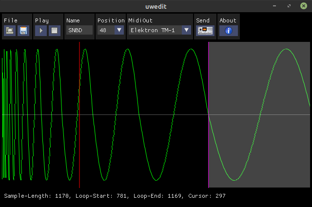
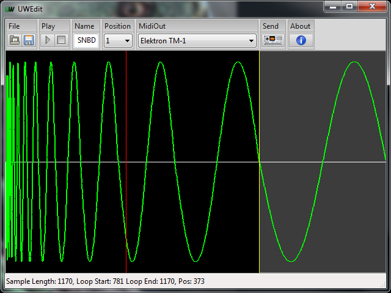

 

## UWedit

Load, save and upload Midi-SDS samples to Elektron Machinedrum UW.

Features:

* Loading and saving Midi-SDS / WAV files
* Setting sustain loop start and end points
* Setting sample name and sample slot
* Sample upload directly to Machinedrum
* Inserting silence at beginning and end
* Waveform inversion
* Normalizing

<!--
Screenshots:

 
 

-->
